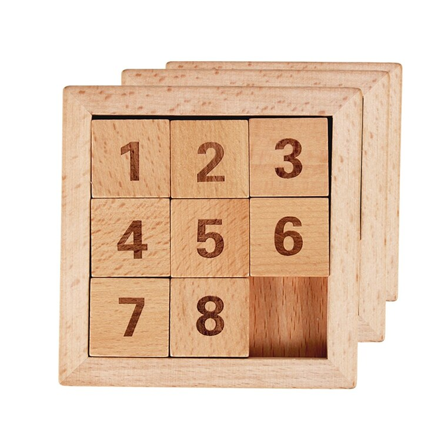

[](https://github.com/RichardLitt/standard-readme)

# Eight Puzzle Solver

The Eight-Puzzle-Solver is a command line program based on A* algorithm. It can solve any customized 8-puzzle and show you a step-by-step trace. Also it allows you to modify macro to easily get a N-puzzle-solver.

## Background
<center></center>

It not always that easy to solve 8-puzzle manually. When it comes to create an intelligent program, however, the average solution cost for a randomly generated 8-puzzle instance is about 22 steps and the branching factor is about 3. (When the empty tile is in the middle, four moves are possible; when it is in a corner, two; and when it is along an edge, three.) This means if we use an exhaustive tree search, to depth 22 would look at about 3<sup>22</sup> ≈ 3.1 × 10<sup>10</sup> states! Thus, rethinking better algorithms, I explored the perfromance of Uniform Cost Search, the Misplaced Tile and Manhattan Distance heuristics applied to A* algorithm. Read my [report](report.pdf) for details.
 
## Install

This project is tested on MacOS and Windows, but should likely work on any platform with C++ compiler for C++11. 

### For Unix based OS

```sh
$ git clone https://github.com/xiongjia000777/eight-puzzle-solver.git
$ cd eight-puzzle-solver
$ make
```
### For Windows

You need change the TARGET in [Makefile](Makefile) before $ make.

 ## Usage
### Run
 ```sh
 $ ./eight_puzzle_solver.out 
 ```
 Then follow the instructions on the screen to enjoy the game.
 (If you encounter "segmentation fault", check the "#define L" in [constant.h](include/contant.h).)

### Get rid of object and executable files
```sh
$ make clean
```
### Way to N-puzzle
Change the "#define N" in [constant.h](include/contant.h). Then modify the [main.cpp](src/main.cpp) to your style by following the comments.
